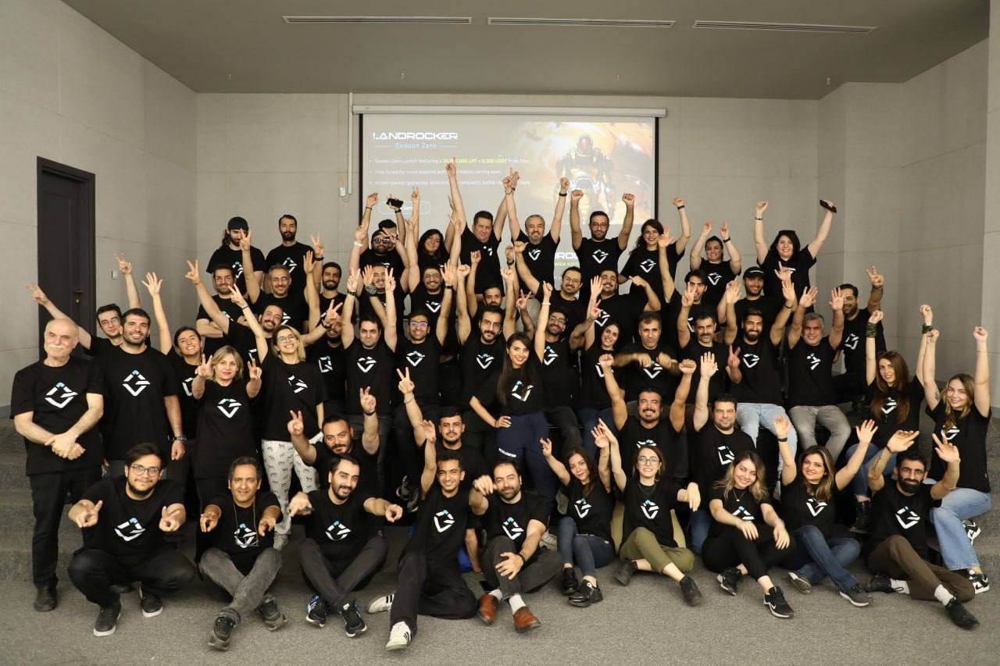

# Team

<figure><figcaption></figcaption></figure>

LandRocker is developed by a talented team of blockchain and gaming experts, led by CEO Hamid Fathalian. The team has a proven track record of delivering successful gaming & IT projects, and is dedicated to creating the best possible gaming experience for LandRocker players. Learn more about the company behind LandRocker at[ Infinite8.ae](https://infinite.ae/).

LandRocker has 32 dedicated team members. Head office is in Dubai, UAE.

* Hamid Fathalian- Founder & CEO
* Behnaz Memarzadeh- CHRO
* Erik Tolstoy- CBDO
* Maral Fathalian- CMO
* Alee Tavanaee- CTO
* Samira Sahraei- COO
* Mohammad Rashid- CPO
* Echen Deligani- Art Director
* Ebrahim Karimi- Lead Engineer
* Moones Khadem- Head of Graphics
* Foad Ghomshei- Music Director/Composer
* Homa Hassani- Executive Director
