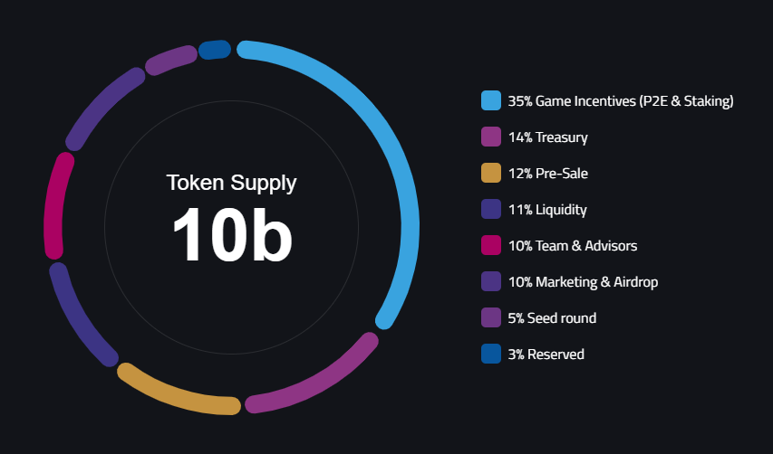

# Tokenomics

<figure><figcaption></figcaption></figure>

LRT is a token that serves as the main governance and utility token of the LandRocker ecosystem. Players can buy LRT, and they can use it to get fuel, rovers, blueprints, and other in-game items on the LandRocker marketplace. LandRocker also offers staking mechanisms that allow players to earn fuel or rovers by staking their tokens for a certain period of time.

LandRocker plans to maintain a fixed supply of LRT, with no further tokens being minted after the initial token sale. This will ensure that LRT retains its value over time, as the demand for the token increases due to the growth of the LandRocker ecosystem.

LRT allocation chart is as follows:

<figure><figcaption></figcaption></figure>

LRT Vesting schedule is as follows:

\

<table data-header-hidden><thead><tr><th width="190"></th><th width="100"></th><th width="384"></th><th width="149"></th><th></th></tr></thead><tbody><tr><td>Allocation</td><td>%</td><td>Amount</td><td>TGE Unlock (%)</td><td>Vesting Schedule</td></tr><tr><td>Seed Round</td><td>5.00%</td><td>500,000,000</td><td>10.0%</td><td>linear vesting over 12 months</td></tr><tr><td>Pre-Sale (Phase 1)</td><td>2.35%</td><td>235,000,000</td><td>25.0%</td><td>linear vesting over 12 months</td></tr><tr><td>Pre-Sale (Phase 2)</td><td>9.65%</td><td>965,000,000</td><td>10.0%</td><td>3-month cliff  then linear vesting over 12 months</td></tr><tr><td>Reserved</td><td>3.00%</td><td>300,000,000</td><td>0.0%</td><td>6-month cliff then linear vesting over 18 months</td></tr><tr><td>Team &#x26; Advisors </td><td>10.00%</td><td>1,000,000,000</td><td>0.0%</td><td>3-month cliff then linear vesting over 24 months</td></tr><tr><td>Treasury</td><td>14.00%</td><td>1,400,000,000</td><td>0.0%</td><td>6-month cliff then linear vesting over 24 months</td></tr><tr><td>Game Incentives (P2E &#x26; Staking)</td><td>35.00%</td><td>3,500,000,000</td><td>2.0%</td><td>linear vesting over 48 months</td></tr><tr><td>Marketing &#x26; Airdrop</td><td>10.00%</td><td>1,000,000,000</td><td>2.0%</td><td>linear vesting over 24 months</td></tr><tr><td>Liquidity</td><td>11.00%</td><td>1,100,000,000</td><td>100.0%</td><td>No vesting</td></tr></tbody></table>

\

LRT smart contract address on Polygon mainnet:\
[https://polygonscan.com/address/0xfb7f8A2C0526D01BFB00192781B7a7761841B16C](https://polygonscan.com/address/0xfb7f8A2C0526D01BFB00192781B7a7761841B16C#code)
